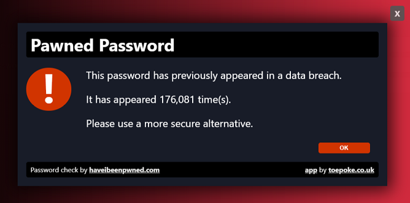

# Pappwords

As responsible website proprietors we want to help and/or educate our users to the risks of poor passwords.

Pappwords piggy backs on the fantastic work of [@troyhunt](https://twitter.com/troyhunt) and his [haveibeenpwned.com](https://haveibeenpwned.com/) website.

Pappwords is a [cloudflare app](https://blog.cloudflare.com/cloudflare-apps-2/) you can install on your website and it will notify your users if the password they are using has been subject to a breach.

## Why Pappwords?

It's a play on words of app, password and papp (if your password has been in a breach, it's a bit papp :smile:)

# Compatibility

Tested working with:

* Chrome
* Firefox
* IE Edge
* IE 10 and 11 (via emulation)

# Credits

* https://github.com/emn178/js-sha1
* https://haveibeenpwned.com/API/v2#PwnedPasswords

