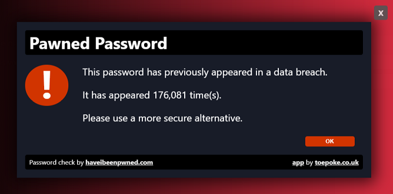

# Pappwords

As responsible website proprietors we want to help and/or educate our users to the risks of poor passwords.

Pappwords piggy backs on the fantastic work of [@troyhunt](https://twitter.com/troyhunt) and his [haveibeenpwned.com](https://haveibeenpwned.com/) website.

Pappwords is a [cloudflare app](https://blog.cloudflare.com/cloudflare-apps-2/) you can install on your website and it will notify your users if the password they are using has been subject to a breach.

## Why Pappwords?

It's a play on words of app, password and papp* - *if your password has been in a breach, it's a bit papp :-)*

* - **papp** *noun*, British, *informal* - rubbish.

## How It Works

Once installed, when a user submits a form with a password, Pappwords will query [Troy's API](https://haveibeenpwned.com/API/v2#PwnedPasswords) to see if the password has been subject to a breach.  If it has the above dialog is shown to the user.

If we think about typical password scenarios in a system, we have:

1. Login - 1 password
2. Register - 2 passwords (password and password confirmation)
3. Change password - 3 passwords (current password, new password and new password confirm)

When the user submits a form (with a password), Pappwords will run a check for pwnage against all password fields in the form.

It then looks at the percentage failure for the passwords in that form.  This is set to 33% by default.  So ...

- If the user logins in with a breached password the failure rate is 100% so the warning dialog is shown.
- If the user changes their password and 1 of the passwords is subject to a breach, the failure rate is 33% so the dialog is shown.
- If however the user changes their passwords and none of the passwords are subject to a breach, the failure rate is zero and the dialog is not shown.

The above means we can use Pappwords on all pages with passwords without being concerned about the scenario being run.

## Options

- Clear password fields (boolean) - If a password is subject to a breach the password field will be cleared, forcing the user to enter a another password.  Defaults to true.
- Warn only (boolean) - If true, the end-user is told their password has been subject to a breach, but the form will still submit.  Default is false.
- Failure Percentage (decimal) - See above.  Defaults to 33%.
- Message (string).  The message the user sees in the breached dialog.  Defaults to the text in the above screenshot.

# Compatibility

Tested working with:

* Chrome
* Firefox
* IE Edge
* IE 10 and 11 (via emulation)

# Credits

* [https://github.com/emn178/js-sha1](https://github.com/emn178/js-sha1)
* [https://haveibeenpwned.com/API/v2#PwnedPasswords](https://haveibeenpwned.com/API/v2#PwnedPasswords)

